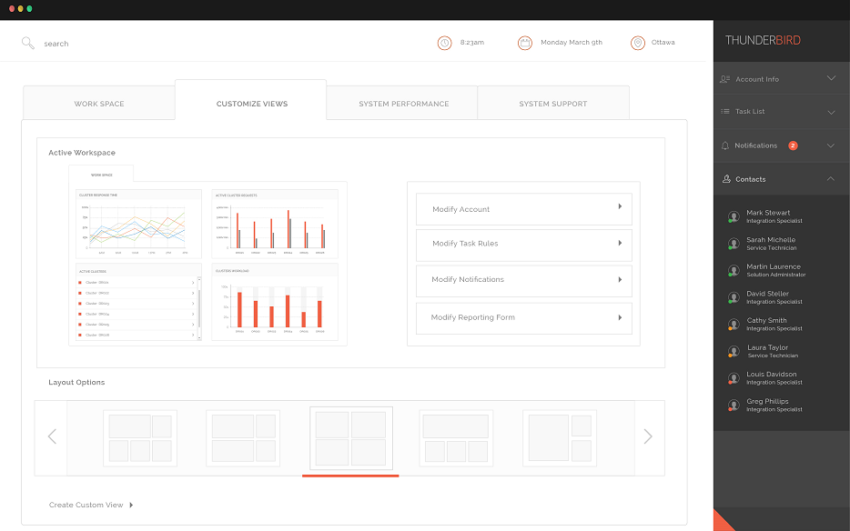

Create custom data views that provide analytics specific to the needs of your project.

In the **Customize Views** page, you can query a range of different entities in order to analyze different aspects of your project and associated cluster activity. You can analyze the tasks, targets, and clusters associated with your project. This allows you to gain more powerful insights into the status and progress of your project.

There are a variety of existing data analysis tasks available for constructing your queries or you can develop your own. Once you have developed your custom data view, you can save, print, or export the results.

|**Analysis Pane**|Displays the returned results. The data will be displayed differently and different commands will be available, depending on the type of data analyzed and the types of queries enacted.|
|Number of Results|Displays the number of returned results. A warning is issued when your query returns too many rows. If this happens, adjust your query filters to reduce the number of results.|
|Data columns|Right-click a column heading to determine whether a column is displayed in the report pane.|
|**Entity Pane**|Lists the data analysis tasks and other parameters - including tasks, clusters, users, and hosts - that are available for analysis.|
|**Query Pane**|Use the **Query Pane** to set up the queries from your analysis.|
|Query filters|Use the filters in the **Query Pane** tab to set up your query. Click on a filter heading to turn it on or off. Invalid filters display as *Warning* or *Error*. Hover your mouse over the filter to view the reason it is invalid.|
|**Generate**|Click to run your data analysis.|
|**Export** button|Click to export your data analysis once it is generated.|
|**Print** button|Click to print your data analysis once it is generated.|
|**Save** button|Click to save your data analysis as a data view.|

