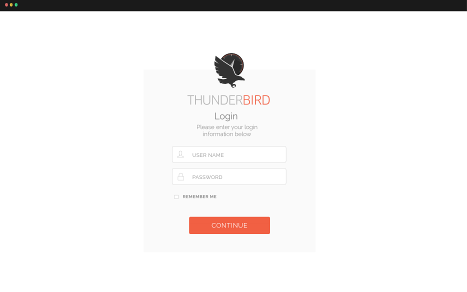

To log on to MobileView, you must open the MobileView application and connect to the ClusterControl server.

Make sure that you have your username, password, and the name of the server that you want to connect to.

Once you are logged on, you can log off and disconnect from a particular project without closing MobileView. Logging off without closing the application is helpful if you plan to log on again using a different username and password.

**Note:** You might automatically be logged off after a period of inactivity.

1.  To log on to MobileView:
2.  To open MobileView, click **Start** > **All programs**Thunderbird MobileView.

    You will see the MobileView Login Screen.

    

3.  In the dialog box, do one of the following:

    -   Enter your MobileView username and password.
    -   Log on using your Windows user account by selecting the **Windows** selection button.
4.  In the directory field, enter the name or IP address of the main StormCluster ClusterControl server.

5.  If you are required to log on with supervision, your supervisor must provide a username and password.

6.  Click **Log In** button.

7.  To log off, click the **Home** tab and then click **Log Off** button.

