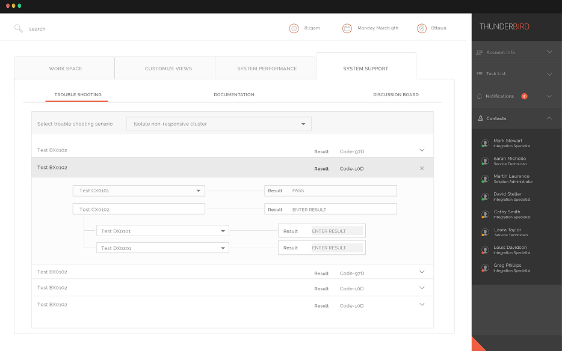

View analysis of cluster status and performance. The data views will indicate whether active clusters are performing as expected or not.

The **Troubleshooting** sub-tab provides a data view for cluster modules actively engaged with your project's tasks. The data views provide details regarding the current status and projected performance of the cluster modules.

The System Diagnostic troubleshooting agent will run a series of interactive tests to identify and isolate problems within the StormCluster grid. A typical interaction would proceed as follows:

-   User selects the **Troubleshooting Scenario** that best fits the observed situation.
-   A series of tests will run, with results either being captured and displayed automatically or being observed and entered by the user.
-   The result from one test may lead to one or more additional tests being run.
-   One or more problems will be identified, isolated, and confirmed by the tests.
-   One or more resolution measures will be identified.
-   Resolution measures will include references to the applicable task documentation.

<a id="p\_pl5\_x5m\_mr"/>For each cluster module, a data view presents a graph depicting the clusters progress. Three different health indicators signal the current or future processing status:

|Indicator|Status|Description|
|---------|------|-----------|
||Healthy|Indicates regular and sustained cluster performance.|
||Warning|Indicates that the cluster is not performing optimally or cannot address projected workloads.|
||Error|Indicates that the cluster has stopped processing a task.|

If the cluster has stopped processing a task, it is not performing optimally, or it cannot address projected workloads, you will also receive a notification message alerting you to the problem. Visit the **Diagnostics Tab** to see additional information on the issue, select actions to amend the situation, and monitor the impact of your intervention.

