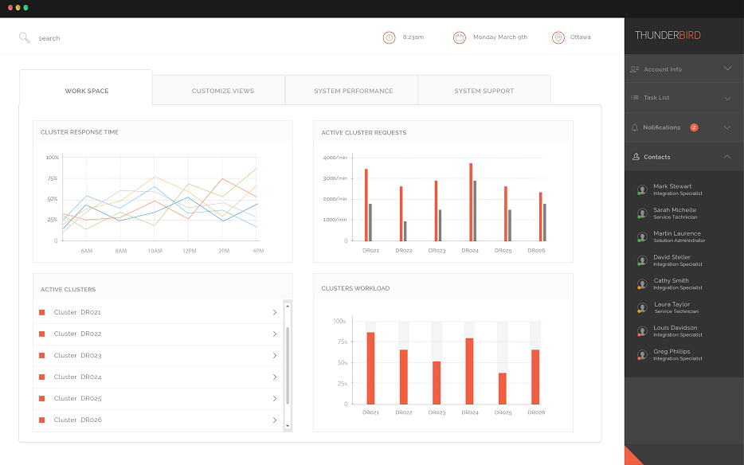

View an analysis of cluster operations.

The **Workspace Tab** includes four different data views to provide a detailed overview of how your project is using cluster resources. These data views display:

-   Cluster response time
-   Cluster requests
-   Active host servers
-   Cluster workload

Content is automatically updated in these data views when events occur related to the project you are monitoring. This provides you with real-time information that is crucial for monitoring your project's use of cluster resources as effectively and efficiently as possible.

|****Account Information****|Access and modify account information.|
|****Task List****|Access assigned tasks.|
|****Notifications****|View notifications.|
|****Contacts****|View a list of contacts and interact using messaging.|
|**Search**|Search for documentation, cluster hosts, reports, and other resources.|
|**Session Details**|Displays current session details including date, time, and location.|
|****Workspace Tab****|View reports on cluster operations. The **Workspace** tab includes different data views to provide a detailed overview of how your tasks are using cluster resources.|
|****Customize Views Tab****|Access the **Customize View** tab to reconfigure the: -   reports that are displayed in the **Workspace** tab-   the layout of reports within the **Workspace** tab-   the definition of individual reports-   the design of customer reports|
|****System Performance****|View reports on task progression and cluster activity. These reports provide in depth, real-time analytic information about current jobs and the associated cluster activity. View reports on job progression. The **System Performance** tab displays your current jobs as they progress towards their targets.You can modify the reports according to the time period and tasks displayed.|
|**System Support**|The **System Support** tab provides access to three important sub-tabs:-   **Troubleshooting** which provides access to structured diagnostic procedures to be used to isolate and resolve system problems.-   **Documentation** which can be searched using a combination of full-text queries and filter selections.-   **Discussion board** where past and ongoing moderated discussions can be accessed and participated in. **Contact Support** if you have trouble using MobileView and cannot find the answers you need on the Troubleshooting or Documentation pages.|

